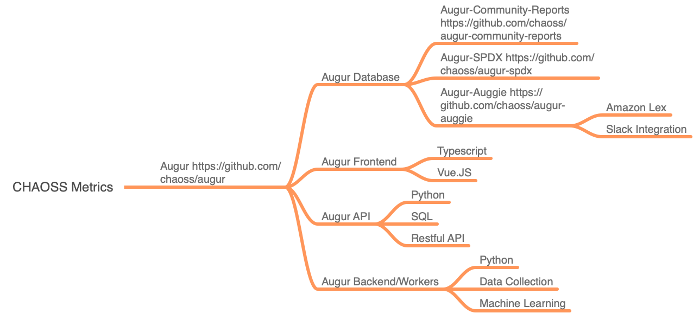

# Semester Project

## Setting up student meeting times
1. Each team will have a virtual deployment machine that I provide. It will have sufficient disk space and 12 GB of virtual RAM. 
2. We will work together to discuss the requirements you will work on, and organize your projects. 
3. Times I have set aside right now are: 
    - TBD
    - Going to occur between Monday, October 24, and Saturday, October 30.
4. You will each have an populated Augur Database at your disposal, and installed for you in your VM. It will have data from a set of around 100 Open Source Software Projects. There are three repositories you can use in different combinations to address the requirements for your project. 
    - https://github.com/chaoss/augur (required)
    - https://github.com/chaoss/augur-community-reports 
    - https://github.com/augurlabs/augur_view 
    - https://github.com/sandiego-rh/explorer

## Resources for Getting Started and Requirements (All groups need at least one use case, including the diagram. Some groups may be able to more easily express the details of their requirements narratively or in the spreadsheet template from the requirements module)
 - [Use Case Template]
 - [Requirements Template : The Spreadshee]

### Augur Software

1. [Augur Documentation](https://oss-augur.readthedocs.io/en/dev/)
2. [Augur Community Reports Repo](https://github.com/chaoss/augur-community-reports)
3. http://gov.chaoss.tv/api/unstable/repos
5. [Contributor Analysis from augur-community-reports](https://docs.google.com/presentation/d/1rLuEROyKlujjPd9AEQ5z1v0V1WPYagv454SBHFNpRDU/edit#slide=id.g8b77fbdb00_0_5)

### Augur Documentation
1. [Conceptual Overview of Augur Data](http://www.augurlabs.io/under-the-hood-with-augurs-data/)
2. [Augur's Full, physical data model](http://www.augurlabs.io/augurs-full-physical-data-model/)
3. [Currently open Augur Issues](https://github.com/chaoss/augur/issues) or issues you create.

### Candidate Ideas
0. [Metrics Currently Under Development That You Could Create EndPoints For](https://docs.google.com/spreadsheets/d/1tAGzUiZ9jdORKCnoDQJkOU8tQsZDCZVjcWqXYOSAFmE/edit#gid=1004270137)
1. New visualizations using the Dash/Plotly environment
2. Ecosystem Level Queries and Analysis (i.e., looking at collections of repositories and comparing them)
4. Documentation Updates, especially developer instructions
5. Frontend redesign or new front end using tools like Graphana, using https://github.com/augurlabs/augur_view as your baseline 
7. Many, many more to discuss!

## Schedule and Deliverable Overview
- 
- 

