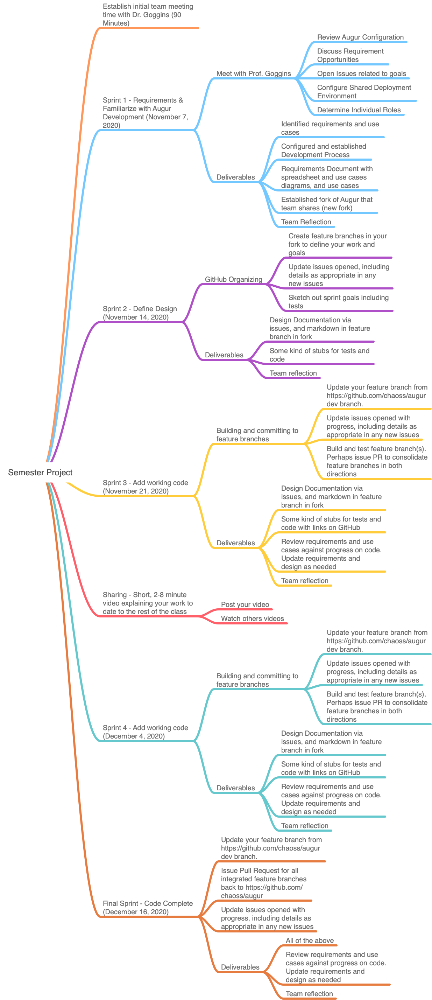

# Semester Project: Module 2

## Deliverables  **SUBMIT ONLY ONE TIME FOR EACH TEAM**
1. Design Document
2. "Hello World version of your project (Prove the Tech end to end)" **Some groups may have short delays due to the server setup not being complete by me right now, but most groups have API and Frontend work that can be completed without a deployment environment at this stage** 
3. Updates to Requirements as needed, based on my feedback. 
4. Refer to Module 5 for Criteria for Design Documents. Consider your goals, scope, and the central importance of clear communication in plain english

## Schedule and Deliverable Overview

